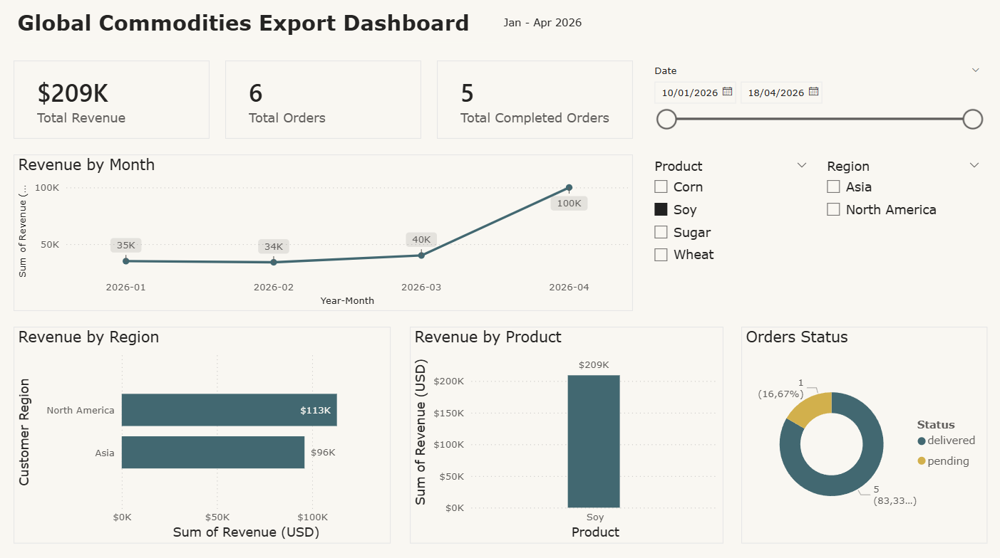

# ETL Data Pipeline + Power BI Dashboard

## Overview
This project simulates a real-world data pipeline for business intelligence, integrating multiple data sources and generating insights through a Power BI dashboard.

The solution demonstrates both visual and programmatic ETL approaches, reflecting how data workflows can evolve from exploratory analysis to scalable pipelines.

---

## Architecture

Raw Data → ETL (Power Query / Node.js) → Processed Dataset → Dashboard

---

## Technologies Used

- Power BI (Dashboard & Data Visualization)
- Power Query (Visual ETL)
- Node.js (Programmatic ETL Pipeline)
- CSV / JSON (Data Sources)
- Git & GitHub

---

## ETL Process

### 1. Extract
- Sales data (CSV)
- Customers data (CSV)
- Orders data (JSON)

### 2. Transform
- Data cleaning and type normalization
- Joins between datasets (sales, customers, orders)
- Creation of derived fields:
  - `year_month`
  - `price_per_ton`
- Data validation and consistency checks

### 3. Load
- Final dataset generated at:
  `/data/processed/final_dataset.csv`
- Loaded into Power BI for analysis

---

## ETL Approaches

### Power Query (Power BI)
Used for:
- Exploratory data transformation
- Rapid prototyping
- Visual data modeling

### Node.js ETL Pipeline
Custom script that:
- Reads CSV and JSON sources
- Transforms and joins datasets
- Generates a final processed dataset

Run the pipeline:
```bash
node src/etl.js
```

---

## Dashboard



### Key Metrics:
- Total Revenue
- Total Orders
- Completed Orders
- Average Price per Ton

### Analysis:
- Revenue over time
- Revenue by region
- Revenue by product
- Order status distribution

---

## Business Context

This project simulates a global commodities export scenario, including:
- Logistics flows (origin and destination ports)
- International customers
- Multi-region sales analysis

---

## Key Learnings

- End-to-end ETL pipeline design
- Data integration from multiple sources
- Data modeling for business intelligence
- Dashboard design best practices
- Difference between visual and programmatic ETL approaches

---

## Future Improvements

- Automate pipeline with scheduling (cron/jobs)
- Store data in a database (PostgreSQL)
- Deploy dashboard with Power BI Service
- Add data validation and error handling

---

## Project Structure

```
etl-data-pipeline-dashboard/
│
├── data/
│   ├── raw/
│   └── processed/
│
├── src/
│   └── etl.js
│
├── dashboard/
│   ├── etl-dashboard.pbix
│   └── dashboard-preview.png
│
└── README.md
```

---

## Author

Lucas Tadeu da Silva Menezes